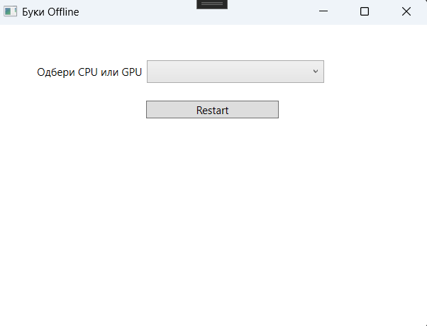

# Буки на домашен компјутер (Буки offline runner)

## Индекс

- [За апликацијата](#за-апликацијата)
- [Конфигурација](#конфигурација)

## За апликацијата
#### Линк до Core проектот - https://huggingface.co/Macedonian-ASR

#### Оваа апликација го автоматизира процесот на стартување на Core проектот (инсталира python, креира средина со потребни библиотеки за старт на апликацијата и го стартува Core проектот).
#### Наменета е да се користи на домашен компјутер со Windows 10 и Windows 11 оперативен систем (не е потребна интернет конекција за процесот на транскрипциија, но потребна е интернет конекција за прво симнување на проектот).

## Конфигурација

- Потребно е да имате инсталирано .NET 10 Runtime на компјутерот каде ќе ја користите апликацијата
- Старт на BukiOffline.exe
- Одбери CPU (процесор) или GPU (графичка карта) за процесот на транскрипција
- Одбери фајл за транскрибирање

Резултатот (транскриптот) ќе биде прикажан во конзола (CMD).
Потребни се администраторски права при старт на конзолата и при инсталирање на Python.

